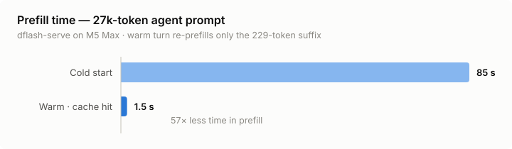

<p align="center">
  <h1 align="center">dflash-mlx-autoresearch</h1>
  <p align="center">DFlash speculative decoding for Apple Silicon,<br>tuned for coding-agent workloads: prefix caching, cache-key normalization, and a DSpark drafter port</p>
</p>

<p align="center">
  
  
  
</p>

A fork of [bstnxbt/dflash-mlx](https://github.com/bstnxbt/dflash-mlx) (v0.1.3) focused on one question: **can a local model on a Mac actually drive a coding agent?**

Speculative decoding solves decode speed. What it doesn't solve is that agent harnesses resend an ever-growing conversation prefix every turn — and at agent scale (20k–30k token prompts), prefill dominates. This fork adds a prefix cache designed around how agent frameworks actually construct prompts, plus support for the RadixArk DSpark drafter family.

**Headline numbers** (M5 Max, 128 GB / 614 GB/s):

| Metric | Before | After |
|---|---|---|
| Warm-turn prefill, 27k-token agent prompt | ~85 s | **1.5 s** |
| Decode, Qwen3.5-35B-A3B (8-bit MLX) | 114.2 tok/s cold | **118.4 tok/s warm** |
| Correctness (warm vs. cold output) | — | **bit-identical** |

<picture>
  <source media="(prefers-color-scheme: dark)" srcset="docs/img/prefill-dark.svg">
  
</picture>

## Why the stock prompt cache wasn't enough

The journey here is five root causes deep, each found by instrumenting real agent sessions (opencode, pi) against the server:

1. **The hybrid-cache trim bug.** `mlx_lm`'s prompt cache silently never hits for hybrid-attention targets (Qwen3.5's GatedDeltaNet + attention mix): `can_trim_prompt_cache` returns `False` for mixed `ArraysCache` + `KVCache`, so every turn was a full re-prefill with no error or warning.

2. **Exact-prefix cache** (`dflash_mlx/serve.py`, `runtime.py`). Rather than fight the trim machinery, the fork snapshots KV state at known-good points and does longest-prefix lookup over stored snapshots. Sidesteps trimming entirely, works for hybrid and pure-attention targets alike.

3. **Commit-boundary snapshotting.** A naïve snapshot taken at end-of-generation can never match the next request, because the chat template appends a generation-prompt suffix (Qwen3.5: `<|im_start|>assistant\n<think>\n`, 5 tokens) that the next request's history doesn't contain. The runtime detects this suffix and snapshots *before* it, at the boundary of committed conversation content — so any future turn whose committed history matches can hit.

4. **Server-side `<think>` stripping.** Agent frameworks strip thinking blocks from *historical* assistant turns between requests. The server's snapshot contained them; the client's next prompt didn't — guaranteed cache miss on every turn for thinking models. The fork strips `<think>…</think>` from committed history server-side too, normalizing the cache key so both sides agree.

5. **Whitespace normalization.** After stripping a thinking block, a trailing-whitespace token (e.g. `\n\n`, token 271) is left behind, and clients handle it inconsistently. The cache key eats trailing whitespace tokens after the strip.

Plus **MISS-DIAG logging**: on a cache miss with a near-match entry, the server logs the divergence position and decoded token windows around it on both sides. Every root cause above after the first was found this way — the cache is self-diagnosing.

### Correctness

`--phase warm` vs. server-restart `--phase cold` on identical requests produces **bit-identical output**. The cache changes when prefill happens, never what gets generated.

## DSpark drafter support

The fork also ports the [RadixArk DSpark](https://huggingface.co/RadixArk) drafter family (e.g. `RadixArk/Qwen3.8-27B-DSpark`), which differs from z-lab DFlash drafters in two ways:

- **Shifted next-token semantics**: every block hidden state (anchor included) predicts one position *ahead*, so a block of N inputs proposes N drafts, verified as `[anchor] + drafts`. z-lab drafters mask-fill in place. Getting this wrong is a ~7× acceptance penalty (11.7% vs. 84.6% measured).
- **Markov bigram-bias head** chained through the block at draft time, matching SGLang's `run_markov_block`.

Measured (M5 Max, Qwen3.8-27B 4-bit target, temp 0): **58 tok/s at 84.6% acceptance on code** vs. 32.6 tok/s plain autoregressive — with acceptance dropping to ~56–64% on freeform prose (adaptive block length via the confidence head is not yet ported). Known ceiling: an 8-token speculative verify costs ~3× a single AR step on hybrid GatedDeltaNet targets; that verify path is the next optimization target.

## Decode benchmarks

Server-reported decode tok/s on the DFlash path, ~1.7k-token context, M5 Max 128 GB:

| Target | Quant | Cold | Warm (cache hit) |
|---|---|---|---|
| Qwen3.5-27B (dense hybrid) | 4-bit | 32.8 | 35.5 |
| Qwen3.5-35B-A3B (MoE, 3B active) | bf16 | 57.8 | 66.4 |
| Qwen3.5-35B-A3B (MoE, 3B active) | 8-bit | **114.2** | **118.4** |

These track the memory-bandwidth ceiling (614 GB/s ÷ bytes-per-active-token) closely — the MoE 8-bit config decodes at ~80% of the theoretical peak with DFlash verify overhead included. The dense-27B and MoE rows used community-quantized/finetuned MLX builds; decode speed is a function of architecture and quant, not the finetune.

Upstream's DFlash-vs-AR benchmark table for stock models is in the [upstream README](https://github.com/bstnxbt/dflash-mlx#benchmarks); per-run JSON reports in [`benchmark/results/`](benchmark/results/).

## Install

```bash
git clone https://github.com/el3mentdev/dflash-mlx-autoresearch
cd dflash-mlx-autoresearch
pip install -e .
```

## Usage

```bash
# Serve with prefix caching (keep up to 4 KV snapshots)
dflash-serve --model mlx-community/Qwen3.5-35B-A3B-4bit \
  --draft-model z-lab/Qwen3.5-35B-A3B-DFlash \
  --host 127.0.0.1 --port 8000 --prompt-cache-size 4

# DSpark drafter
dflash-serve --model mlx-community/Qwen3.8-27B-4bit \
  --draft-model RadixArk/Qwen3.8-27B-DSpark \
  --host 127.0.0.1 --port 8000 --prompt-cache-size 4
```

Watch stderr for `[dflash] prefix cache HIT/STORED` lines and per-turn tok/s. On a miss with a near-match, `MISS-DIAG` lines show exactly where the incoming prompt diverged from the best snapshot.

`--draft-model` accepts a local directory path as well as a HuggingFace repo id.

### Getting cache hits from your agent harness

The cache can only help if the client resends a strict prefix. What matters, from testing real harnesses:

- **Static system prompt** — per-turn injection of cwd/timestamps into early tokens poisons every snapshot.
- **Append-only history** — context compaction that rewrites earlier turns (LLM summaries) breaks prefix extension.

(Upstream's fast-path AR bypass for `max_tokens <= 256` is disabled in this fork, so short requests take the DFlash path and hit the cache like any other.)

Thinking-block stripping by the client is fine — that's what the server-side normalization is for.

## Models

Draft models:

| Draft | Type | For target family |
|---|---|---|
| [z-lab/Qwen3.5-27B-DFlash](https://huggingface.co/z-lab/Qwen3.5-27B-DFlash) | DFlash | Qwen3.5-27B (dense hybrid) |
| [z-lab/Qwen3.5-35B-A3B-DFlash](https://huggingface.co/z-lab/Qwen3.5-35B-A3B-DFlash) | DFlash | Qwen3.5-35B-A3B (MoE) |
| [RadixArk/Qwen3.8-27B-DSpark](https://huggingface.co/RadixArk/Qwen3.8-27B-DSpark) | DSpark | Qwen3.8-27B |

Stock targets (see also [upstream's tested-models table](https://github.com/bstnxbt/dflash-mlx#tested-models)):
[mlx-community/Qwen3.5-27B-4bit](https://huggingface.co/mlx-community/Qwen3.5-27B-4bit) ·
[mlx-community/Qwen3.5-35B-A3B-4bit](https://huggingface.co/mlx-community/Qwen3.5-35B-A3B-4bit) ·
[mlx-community/Qwen3.8-27B-4bit](https://huggingface.co/mlx-community/Qwen3.8-27B-4bit)

For full provenance, the benchmark tables above were measured on community variants: the 27B rows used [TheCluster/Qwen3.5-27B-Heretic-MLX-4bit](https://huggingface.co/TheCluster/Qwen3.5-27B-Heretic-MLX-4bit), and the 35B-A3B rows a locally-quantized 8-bit MLX build of [huihui-ai's finetune](https://huggingface.co/huihui-ai/Huihui-Qwen3.5-35B-A3B-abliterated). Architecture and quant determine the speed numbers; the stock models above should reproduce them.

## Reproducing the numbers

`repro/` contains the harnesses behind the claims above, runnable against any dflash-serve instance (`DFLASH_BASE_URL` / `DFLASH_MODEL` env vars to point them elsewhere):

```bash
# Correctness: warm output must match cold output
python repro/test_prefix_cache.py --phase warm     # seeds cache, saves turn-2 output
# ...restart dflash-serve (drops the in-memory cache)...
python repro/test_prefix_cache.py --phase cold     # same request from cold
python repro/test_prefix_cache.py --phase compare  # expect EXACT MATCH

# Cache smoke test + timing (single server, no restart)
python repro/test_prefix_cache.py --phase smoke

# Cold-vs-warm decode/prefill timing
python repro/bench_decode.py --prompt-tokens 1000 --max-tokens 300 --n 3
```

## autoresearch harness

`autoresearch/` contains a pinned, seeded Spec-Bench harness (adapted from [karpathy/autoresearch](https://github.com/karpathy/autoresearch)) for measuring runtime changes: 10 balanced prompts, fixed budgets, `speedup` as the primary metric and token-match rate against the baseline greedy trajectory as the guard rail. Model and dataset locations are overridable via `AUTORESEARCH_TARGET_MODEL`, `AUTORESEARCH_DRAFT_MODEL`, and `AUTORESEARCH_SPECBENCH_QUESTIONS`.

## Roadmap

- **SSD-backed snapshot persistence** — survive server restarts; ~14 GB/s SSD loads a 1 GB snapshot in ~70 ms
- **DSpark confidence head** — adaptive block length, mainly to recover prose acceptance
- **Hybrid verify cost** — the 3× verify-vs-AR-step gap on GatedDeltaNet targets is the biggest remaining decode lever
- **MoE block-size tuning** — current `DFLASH_VERIFY_LEN` / `block_tokens` values were tuned on dense targets

## Relationship to upstream

Built on [bstnxbt/dflash-mlx](https://github.com/bstnxbt/dflash-mlx) v0.1.3, which implements the DFlash runtime (tape-replay rollback, JIT SDPA 2-pass verify, custom Metal kernels) for MLX. Upstream has since (≥ v0.1.10) shipped its own prefix-cache subsystem covering exact-prefix KV snapshots on hybrid targets and ChatML/Gemma commit-boundary snapshotting — independently converging on the same design this fork prototyped. What upstream still lacks, and what remains this fork's distinct contribution, is the cache-key normalization layer for agent clients: server-side thinking-block stripping and whitespace canonicalization (being proposed upstream separately).

DFlash itself is the work of [z-lab](https://github.com/z-lab/dflash) — paper: [DFlash: Block Diffusion for Flash Speculative Decoding](https://arxiv.org/abs/2602.06036) (Chen et al., 2026) — including the draft models used here. DSpark drafters by [RadixArk](https://huggingface.co/RadixArk).

```bibtex
@misc{chen2026dflash,
  title={DFlash: Block Diffusion for Flash Speculative Decoding},
  author={Jian Chen and Yesheng Liang and Zhijian Liu},
  year={2026},
  eprint={2602.06036},
  archivePrefix={arXiv},
  primaryClass={cs.CL},
  url={https://arxiv.org/abs/2602.06036}
}
```

## License

MIT — same as upstream.
